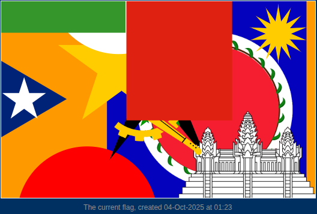
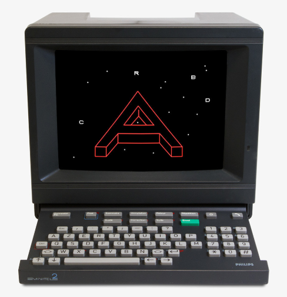
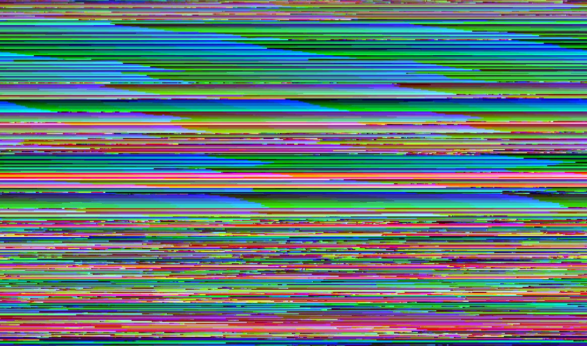
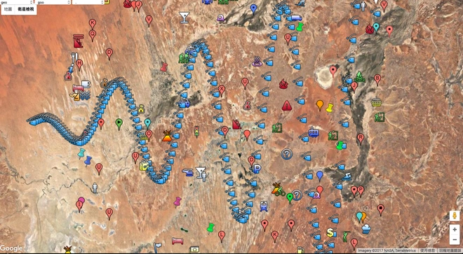
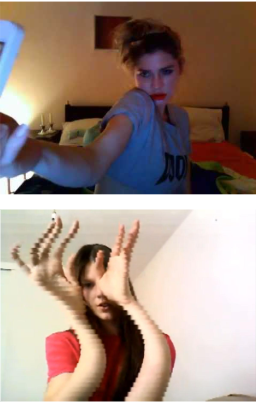
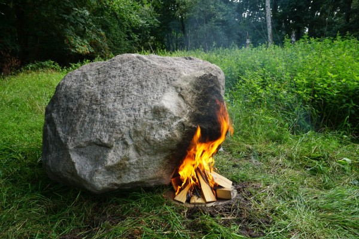
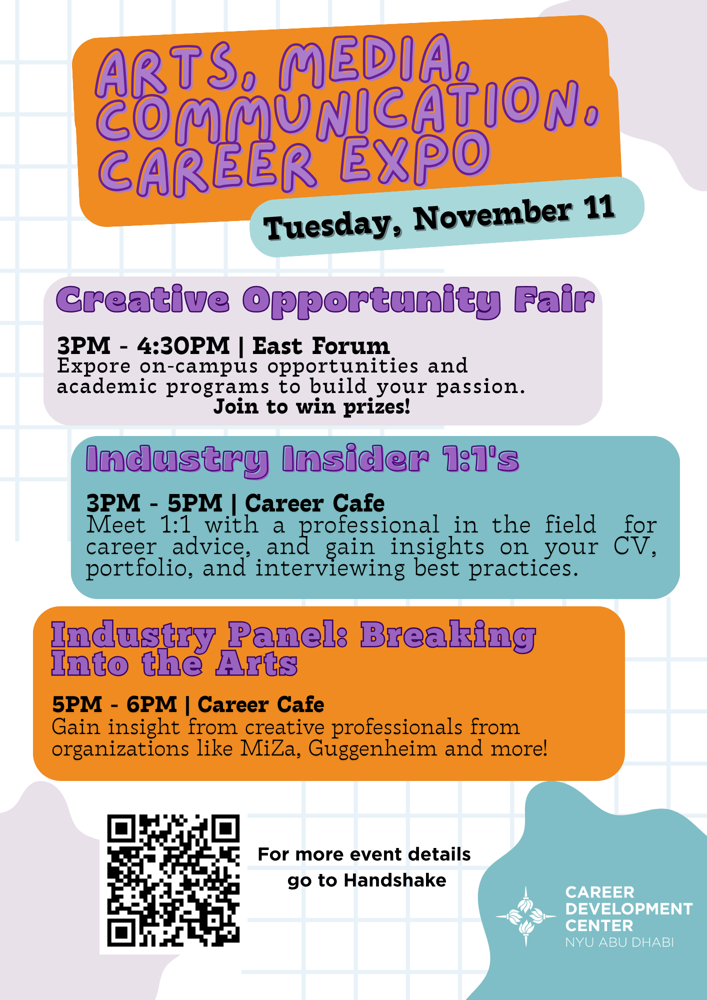

Shortcut to [today's assignment](homework.md#todays-assignment)  
Shortcut to [today's lecture](lectureNotes.md#todays-lecture)  
Shortcut to [groups](https://docs.google.com/spreadsheets/d/1w7-6CPpIk8KJ1PGflO4GyfTNLMPXfhM6RcgevjqOXx0/edit?usp=sharing)

## New York University Abu Dhabi  
## Interactive Media Program
## Course title: Understanding Interactive Media
Course number: IM-UH-1013  

Section: 001

Credit Hours: 4     

Prerequisites: None     

Session: Fall 2025       

Course website:
[https://github.com/michaelshiloh/understandinginteractivemedia/](https://github.com/michaelshiloh/understandinginteractivemedia/)  

Other material:
- [Readings](https://drive.google.com/drive/folders/1_IM74SvDN4GlwIJQtmSUM2WGTHZfnX5a?usp=sharing)
- [Lectures](https://drive.google.com/drive/folders/11BUmYWTcuoL0unxcGSFyNUksf8Mgt8CY?usp=sharing)
- [Grading Rubrics](https://drive.google.com/drive/folders/1N7vikHjB3R4llwI-HjBRahrWgJVwIu09?usp=sharing)

Instructor: Michael Shiloh mshiloh@nyu.edu   

Office hours: Schedule an appointment [here](https://calendly.com/michaelshiloh/office_hours)

Meeting times:    
- 9:55 - 11:10 Tuesday
- 9:55 - 11:10 Thursday

Class location: C3-043

This is subject to change

This document: Lecture Notes

### Tuesday August 26 Week 1
- Administration
- What is this class about?
- Introductions

#### Administration
- I'll be gone next week!

#### What is this class about?
- [Schedule](https://docs.google.com/spreadsheets/d/1zGzVWv8EfPugCYiW7lyvZhyrRkXWa1TY/edit?gid=1040288533#gid=1040288533)
- [Syllabus](syllabus.md)

- Modules
- Each module
    - Readings
    - Lecture
    - Group activity

#### What is this class really about?

- What is art?
- What is Interactive Media?
- How do you explain what you do?
- How do you put your work into context?
- How do you justify your work?

#### Introductions

- Why did you choose IM?
- What is your creative passion?
- What kind of art do you like?
- What kind of thinking about art do you like?
- What are some of your favorite art exhibitions?
- What other questions can we talk about?

- About me

### Thursday August 28 Week 1
- Module 1: Conceptual Art, Procedural Art, Algorithms, Programmable Objects

#### Administration
- I'll be gone next week!

#### Conceptual art 

Formalism: a focus on formal properties of an artwork
* What the artwork looks like, what materials it's made of

Modernism
* Late 19th, early 20th-century movement in literature, visual arts,
  performing arts, and music that emphasized experimentation, abstraction, and
  subjective experience.
* Emerged in response to significant changes in Western culture, including
  secularization and the growing influence of science.
* Rejects  the concept of absolute originality upheld in the 19th century by
  both realism and Romanticism, replacing it with techniques of collage,
  incorporation, rewriting, revision, and parody.

Avant-garde
* "Advance guard"
* Identifies the artists and writers whose innovations in style, form,
  and subject-matter push the aesthetic boundaries of societal norms
    * Societal norms represent a "dumbing down", and must be
      constantly challenged
* Includes a great many types such as Cubism, Dadaism, Expressionism,
  Fluxus, Impressionism, Suprematism, etc.
* Early to mid 20th century

Dadaism
* 1915/16-1924
* Strongly political
    * a protest against bourgeois nationalist and colonialist interests, which
      many Dadaists believed were the root cause of the war
    * also against cultural and intellectual conformity — in art and more
      broadly in society — that corresponded to the war

Fountain (Duchamp)
* regarded by art historians and theorists of the avant-garde as a major
  landmark in 20th-century art. 

Readymades
* as an antidote to what he called "retinal art"
* Is he also poking fun at art lovers, museum goers, and collectors?

Conceptual Art
* Emerged as a movement 1960s
* Reaction against modernism and ideas of formalism
* the concept(s) or idea(s) are equal to or more important
  than traditional aesthetic, technical, and material concerns. 
* Forward looking, experimental art movement; progressive,
  revolutionary, changing what art is and means
* Duchamp's readymades can be considered prototypical conceptual artworks
* Reaction against the commodification of art; it attempted a subversion of
  the gallery or museum as the location and determiner of art, and the art
  market as the owner and distributor of art.

Mierle Ukeles
* Activist art?

Procedural art

Sol LeWitt
* was seminal in establishing the notion of ‘Conceptual art’ during the 1960s.
* With the exception of his very first wall drawing exhibited at the Paula
  Cooper Gallery in New York in 1968, the artist did not execute the wall
  drawings himself;
* #1136 is in Tate Modern

Algorithmic art
* Muhammad ibn Mūsa al-Khwarizmī, an influential 9th century scholar,
  astronomer, geographer, and mathematician known especially for his
  contributions to the study of algebra. 

The Latinization of his name, ‘Algoritmi’ gave English the word algorithm.

### Tuesday September 2 Week 2
class cancelled

### Thursday September 4 Week 2
- Administration
- Reading response 
- Time permitting, group project presentations, if you are ready

#### Administration
- I have uploaded the following course material:
    - [Readings](https://drive.google.com/drive/folders/1_IM74SvDN4GlwIJQtmSUM2WGTHZfnX5a?usp=sharing)
    - [Lectures](https://drive.google.com/drive/folders/11BUmYWTcuoL0unxcGSFyNUksf8Mgt8CY?usp=sharing)
    - [Grading
    Rubrics](https://drive.google.com/drive/folders/1N7vikHjB3R4llwI-HjBRahrWgJVwIu09?usp=sharing)
- Class today will be held via [Zoom](https://nyu.zoom.us/j/98763441670?jst=2). You are welcome to join from the classroom or elsewhere.

### Tuesday September 9 week 3
- Finish group presentations
- Lecture: Interactive Media

##### Notes
- Conversation Theory: explaining how conversational interactions lead
  to the emergence of knowledge between participants.

##### Some videos that aren't in the slides
- Masika Fujihata [Beyond Pages](https://www.youtube.com/watch?v=6Ek2DW7aV68)
- FoAM [T-Garden](https://fo.am/publications/t-garden/)
- George Legrady [Pockets Full of Memories](https://www.youtube.com/watch?v=Wak_1YBPM4I)
- Marshmallow Laser Feast [In the Eyes of the
  Animal](https://www.youtube.com/watch?v=XJMA0Nj_zsA)
- [Constanza Pina](https://vimeo.com/constanzapina) [Khipu](https://youtu.be/-L5RoBMKOdM)
- Tony Dove [Te Dress that Eats
  Souls](https://tonidove.com/the-dress-that-eats-souls/video/)

### Thursday September 11 week 3

#### Today
- Finish Lecture: Interactive Media
- Review homework
- Plan for next Tuesday
- Short discussion about lecture

### Tuesday September 16 week 4
- Administration
- Reading discussion
- Check progress of group work

#### Administration
- Brightspace
    - Access
    - Assignment catchup
    - Attendance
    - Participation
- Pizza!
    - Thursday, Sep 18th, 6:30pm - 8:00pm 
    - C3-153 + C3-155 
    - Open to all IM majors, minors, and students enrolled in IM classes

### Thursday September 18 week 4
- Group presentations, Interactive Media

### Tuesday September 23 week 5
- Finish last presentation
- Attention
- Lecture and discussion: Machine Art

#### Machine Art

##### Machine Art in the Twentieth Century

““Machine art” is neither a movement nor a genre; rather, the term encompasses
diverse ways in which artists engage with technical systems. “

““Machine art"—namely, as those artistic works and practices that implicitly
or explicitly articulate the relation between subjects and machines”

Andreas Broeckmann, *Machine Art in the Twentieth Century*
(an overview of the vague terrain of “machine art”, various definitions of 
"machine" and "machine aesthetics")

Q: Think about how you would define *machine art* as we go along

##### Machine Art exhibition at MOMA (1934)

Pictures
[here](https://www.moma.org/calendar/exhibitions/1784?installation_image_index=0)

The notion that machine-made objects have aesthetic value has been with us for
some time, dating back to avant-garde movements of the early 20th century such
as Futurism, which influenced other schools, including the Bauhaus and De
Stijl (focused on geometric abstraction and lack of ornamentation).  However,
the idea that a museum would display a propeller or a vacuum cleaner as a work
of art was startling to many in 1934.

Visitors to *Machine Art* were startled to find three floors of utilitarian,
machine-made objects, such as springs, pots and pans, and scientific
instruments, displayed on pedestals, elevating them to the level of sculpture.

The machine as art vs. the machine as something that makes art

Q: How would you critique or review this exhibition?

##### Robot K-456 (Nam June Paik) 1964

Pictures 
[here](https://njpart.ggcf.kr/collections/251) and
[here](https://cyberneticzoo.com/robots-in-art/1964-robot-k-456-nam-june-paik-korean-shuya-abe-japanese/)

Video
[here](https://www.facebook.com/AmericanMasters/videos/nam-june-paiks-robot/791881432138126/)
and
[here](https://www.youtube.com/watch?v=JmkYjGVVRFA)

- A major figure of the experimental Fluxus movement 
    - (Fluxus was an international, interdisciplinary community of artists,
      composers, designers and poets during the 1960s and 1970s who engaged in
      experimental art performances which emphasized the artistic process over
      the finished product.)
- Nam June Paik is considered the father of video art. His most famous
  sculptures feature real TV sets. He co-invented a video synthesizer using
  analog electronics
- Paik’s practice—which combined music, performance, technology, and
  film—explored the possibilities of mass media and emerging technologies with
  impressive foresight.  
- Coining the term “electronic superhighway” in the 1970s, Paik wrote of a
  near future in which new media technologies would connect populations
  through global networks; in a sense, he predicted the internet. 

- The ide for the robot came from Paik wanting to create a robot for
  impromptu street performances that create a “sudden show” or “split-second
  surprise”.  
- Salvaged, junk, and household materials.  This reflected what would become a
  staple of his artwork, repurposing cheap and disposable materials into brand
  new technologies.  

Q: What does the use of salvaged items, junk, and household materials say
about beauty and aesthetics?

#####  Edward Ihnatowicz 'The Senster'

[Video](https://www.youtube.com/watch?v=CK7ZMRqyTWU)

- Edward Ihnatowicz (1926 -1988) was a cybernetic sculptor who explored
  interactivity between his robotic works and the audience
- The Senster was a 4 meter tall robot, commissioned by Dutch electronics
  manufacturer Philips to be on show at the Evoluon, its exhibition space
  dedicated to science and technology in Eindhoven. 
- It was one of the first computer controlled robotic works of art and could
  be visited between 1970-1974 in the entrance hall gallery of the Evoluon. 
- The work consisted of a steel skeleton, with a resemblance to a dinosaur or
  a giraffe with its long neck. 
- The ‘beast’ reacted to sound and movement made by the visitors. 
- Its two legs remained immobile and connected to the ground, but its neck and
  head moved and could follow people around the room.
- There were three different movement responses built into the robot: 
    - gentle sounds would make its head move toward the visitor, 
    - loud sounds would make the head pull back, 
    - and when a visitor performed fast movements the robot would follow
      these. 
- Spectators reacted with great enthusiasm to the robot.

Picture of it installed in the Evoluon
[here](https://evoluon.dse.nl/index-e.html)

A [fan site](http://www.senster.com/ihnatowicz/index.htm) with much
information

#####  Survival research Labs

[Video](https://www.youtube.com/watch?v=5dcg9MpNYuc)

"Telling a story in a powerful way"

[About](https://srl.org/?location=about.html)

Q:
- Is it spectacle or art? Can it be both? 
- An experience people don't usually get
- Is it interactive?
- Is it [sublime](https://www.tate.org.uk/art/art-terms/s/sublime)

"The theory of sublime art was put forward by Edmund Burke in A Philosophical
Enquiry into the Origin of our Ideas of the Sublime and Beautiful published in
1757. He defined the sublime as an artistic effect productive of the strongest
emotion the mind is capable of feeling. He wrote ‘whatever is in any sort
terrible or is conversant about terrible objects or operates in a manner
analogous to terror, is a source of the sublime’."

More
[videos](https://www.youtube.com/@survivalresearchlabs)

### Thursday September 24 week 5
Machine Art (continued)

#####  Rebecca Horn

[Video](https://www.youtube.com/watch?v=jtrQtrF51Xg)

- Rebecca Horn (1944 - 2024) is a German visual artist 
- best known for her installation art, film directing, and her body
  modifications with body suits.
- Horn describes the machines “have a soul because they act, shake,
  tremble, faint, almost fall apart, and then come back to life again. They
  are not perfect machine (…) I’m interested in the soul of a thing, not the
  machine itself."
- While often constructed with technical precision using hard, cold materials,
  Horn‘s works – in concert with their temporal spacing and ritualistic
  movements – are emotive and sensual, often striking a balance between
  aggression and tenderness.

Q: This balance between aggression and tenderness - do you see this in the
other machine artists?

#####  Arthur Ganson

[Video](https://www.youtube.com/watch?v=__GhJl_UQg0&list=PLTclenKfUcZirva6j_Jc-YWzOlmNRdPmk)

- Arthur Ganson (born 1955) is a kinetic sculptor, inventor and musician
- He makes mechanical art demonstrations with existential themes..
- Ganson describes his work as a cross between mechanical engineering and
  choreography.
- His sculptures have been called "gestural, playful, humorous, evocative, and
  introspective
- Ganson admits that he has been strongly influenced by the likes of such
  Dadaists as Marcel Duchamp and Jean Tinguely.
- Delicate assemblages of interconnecting gears, springs, cams, ratchets and
  sprockets fashioned out of spot-welded bailing wire perform whimsical acts
  with mostly found objects.
- From a distance his sculptures, which are sometimes hand-cranked and
  sometimes motorized, have a homespun 19th century quality.
- They could be absurdist wire doodles.
- Closer up, the movement and gesture implicit in his work becomes strangely
  hypnotic — often humorous, childlike, introspective, and existential.

Q: - How is this work existential?

"I love to solve problems, ... but the end result is ambiguous"o

Found objects - visual puns

The fleetingness of the present moment

"What would I love if I were a machine - I would love to be bathed in oil"

Arthur Ganson at
[TED](https://www.ted.com/talks/arthur_ganson_moving_sculpture)

"All of these pieces start off in my own mind in my heart and I do my best at
finding ways to express them with materials ... somehow I manage to get this
thought out into the object ... the object itself means nothing once it is
perceived and someone else brings it into their mind then a cycle has been
completed ... I've always wanted to communicate my passion, my love, and that
means the complete cycle of coming from inside out to someone perceiving it"

Arthur Ganson at the [Long Now
Foundation](https://www.youtube.com/watch?v=HyCyFe9QFrw)

"In order for a piece to have any meaning to anyone, they create the meaning
If you feel a connection to anything then it's not really in the piece, it's
in you, and it's all about your experience"

[Machine for Softening Hardened
Hearts](https://www.youtube.com/watch?v=HyCyFe9QFrw&t=3774)

##### Peter Flemming

[Video](https://peterflemming.ca/works/canoe)
[Video](https://peterflemming.ca/works/smc)

- Peter Flemming is a full-time artist, part-time professor and some-time
  curator in Montréal who exhibits and works internationally.
- Research interests include ad hoc architecture, intuitive physics, informal
  engineering, solar power, and waste harvest.
- Flemming's work considers natural and technological ecologies, in
  site-specific projects that are resolved intuitively and experimentally.
- “Technological systems for interpreting and shaping desire texture daily
  life; a means to rationally orchestrate the world. Might not there be a need
  for systems which irrationally de-orchestrate?”
- His works like the Canoe dramatically demonstrates that functionality and
  utility are not necessarily synonymous.: Functionality here is a constant -
  complex mechanics running continuously - whereas utility is a widely
  swinging variable.
- Artist statement: My principal aim is to build systems I do not fully
  understand, with the intention of attempting to understand them.
  Technological systems for interpreting and shaping desire texture daily
  life; a means to rationally orchestrate the world. Might not there be a need
  for systems which irrationally de-orchestrate?

Bonus: Stepper motor music
on [bare stepper motors](https://www.youtube.com/watch?v=9of3rHkjV8g)
or on a [CNC milling machine](https://www.youtube.com/watch?v=lCh-LC0UCM0)

#####  Ruben Margolis

[Video](https://www.reubenmargolin.com/waves/cadence/)
[Caterpillar](https://www.reubenmargolin.com/caterpillars/caterpillar-with-chariot/)
Detailed [story](https://www.reubenmargolin.com/waves/contours/) of one
particular sculpture

For the last 20 years I’ve been making kinetic sculptures that seek to combine
the sensuousness of nature with the logic of math. My studio is in a yellow
warehouse in Emeryville, California, a stone’s throw from the San Francisco
Bay. During a typical day I often find myself moving in a circular arc:
beginning, perhaps, with the memory of light on the ocean and the feel of
wind, later being pulled into an irresistible problem involving sine curves,
then leaning toward the drafting table to consider proportion, thread pitch,
and color, pausing at the metal lathe to make a precision part, drilling
countless holes in a piece of wood, always working toward the unparalleled
excitement of switching on a sculpture for the very first time.

Q: Do you find this work calming? meditative?

#####  Alan Rath

[Alan Rath](https://alanrath.net/) is a pioneer in electronic, kinetic, and
robotic sculpture. Alan Rath has produced an ever-evolving body of work since
the early 1980s. Rath was born in 1959 and has been fascinated with machinery
from an early age. He cites important childhood influences that include NASA,
Robert Moog, and Jimi Hendrix.

[Video](https://www.youtube.com/watch?v=9BLp9zyejkM)

Q: Do you find this work calming? meditative?

#####  Jeff Mann and Michelle Teran

[LiveForm:Telekinetics](https://vimeo.com/481096054?fl=pl&fe=sh)

Experiments in connected social spaces

LiveForm:Telekinetics creates experiences in transgeographic temporary
performance zones. No longer tied to a terminal screen and keyboard, nomadic
groups of social hackers pack mobile feasts of sensors, antennas, robotics,
food, and music and head out on the town. Networked telepresence picnic
parties unfold in vacant lots, roadsides, cafes, apartments, alleyways, bars
and hotel lobbies – wherever bandwidth is plentiful and security guards
scarce.

Jeff Mann and Michelle Teran's LF:TK project is an artistic proposition for a
re-imagination of networked reality. The events are not meant as entertainment
for an audience, but as experimental and collaborative acts of creativity,
research and development of new social forms, and interventions in public
space.

Jeff Mann (Hamilton, Canada, 1963) is a creator of electric art, using
computers, electronics, robotics, sound, video, and telecommunications media.
Since the mid-1980's, his work focus on online artists networks, telepresence
performance, and interactive installation.

Michelle Teran (born in Canada) is an educator, artist, and researcher. Her
research areas encompass socially engaged and site-specific art,
counter-cartographies, social movements, feminist and critical pedagogy.

More
[here](https://web.archive.org/web/20070214070929/http://www.lftk.org/tiki/tiki-index.php)

##### [Stelarc](http://stelarc.org)

- Born in Cyprus 1946
- lives in Australian 
- performance artist 
- works focus heavily on extending the capabilities of the human body. As
  such, most of his pieces are centred on his concept that "the human body is
  obsolete". 

- [Exoskeleton](https://www.youtube.com/watch?v=rTOGhVmye-A)
- [Extended Arm](https://www.youtube.com/watch?v=PWSYkplTG2s)

##### Bill Vorn [Hysterical Machines](https://billvorn.concordia.ca/robography/hysterical.html)

[Video](https://www.youtube.com/watch?v=o0kRnEVIt20)

This project is part of a larger research program on the Aesthetics of
Artificial Behaviors and is very much inspired of a previous work based on the
Misery of the Machines (Bill Vorn, LP Demers, La Cour des Miracles, 1997). It
is conceived on the principle of deconstruction, suggesting dysfunctional,
absurd and deviant behaviors through a functional machine. It operates on a
dual-level process expressing the paradoxal nature of Artificial Life.

The aim of this project is to induce empathy of the viewer towards characters
which are nothing more than articulated metal structures. The strength of the
simulacra is emphasized by perverting the perception of the creatures, which
are neither animals nor humans, carried through the inevitable instinct of
anthropomorphism and projection of our internal sensations, a reflex triggered
by any phenomenon that challenges our senses.

Born and living in Montreal, Bill Vorn has been active in the field of Robotic
Art since 1992. His installations involve robotics, motion control, sound,
lighting, video and cybernetic processes that evoke human qualities in
articulated metal structures.

##### Thecla Schiphorst [Soft(n)](https://v2.nl/works/softn)

- Media artist, choreographer, dancer, and computer systems designer and
  Associate Professor in the Computer Arts and Design Sciences Program at
  Simon Fraser University in Vancouver, Canada.
- Her background in performance and computing forms the basis for her research
  which focuses on embodied interaction, sense-making, and the aesthetics of
  interaction.
- She is particularly interested in the poetic forms that cultivate affect,
  materiality and experience-modeling within human computer interaction.
- soft(n) explores intimacy and experience through physical interaction with
  10-12 networked soft objects that exhibit emerging behavior when touched or
  moved within a space.
- The network recognizes the quality of tactile and kinesthetic interaction,
  responding to how objects are touched or moved.
- Interaction with the soft objects elicits behaviors such as humming,
  shaking, sighing, singing and shared moving luminous patterns.
- Each soft object is hand constructed and contains a specially designed,
  hand-sewn and custom-engineered soft-intelligent-tactile input surface,
  motion detectors, and an ability to respond through vibration, light, and
  sound.

##### Louis-Philippe Demers and Bill Vorn [Inferno](https://vimeo.com/130670526)

Inferno is a robotic performance inspired by the representation of the
different levels of hell as described in Dante's Inferno or the Singaporean
Haw Par Villa's Ten Courts of Hell (which is based on a Chinese Buddhist
representation). 

The specificity of this performance resides in the fact that the different
machines involved in the show are installed on the viewers' body. The public
then becomes an active part of the performance. Sometimes the viewers are free
to move; sometimes they are in a partial or entire submission position, forced
by the machines to act/react in a certain way. Some mechanical elements coerce
the viewers in performing certain movements; others induce a physical reaction
from them. For this performance of about an hour long, we have built 25
wearable robotic structures very similar to exoskeletons.

##### [Can’t Help Myself by Sun Yuan and Peng
Yu](https://www.youtube.com/watch?v=ZS4Bpr2BgnE)

- Sun Yuan (born 1972) and Peng Yu (born 1974) are Chinese conceptual artists
  whose work has a reputation for being confrontational and provocative.
- They have lived and worked collaboratively in Beijing since the late 1990s.
- They create pieces that dive deep into human nature, psychological, and
  political experiences.
- Can’t Help Myself was commissioned for the Guggenheim Museum.
- Sun Yuan & Peng Yu employ an industrial robot, visual-recognition sensors,
  and software systems to examine our increasingly automated global reality,
  one in which territories are controlled mechanically and the relationship
  between people and machines is rapidly changing.
- Placed behind clear acrylic walls, their robot has one specific duty, to
  contain a viscous, deep-red liquid within a predetermined area.
- When the sensors detect that the fluid has strayed too far, the arm
  frenetically shovels it back into place, leaving smudges on the ground and
  splashes on the surrounding walls
- Observed from the cage-like acrylic partitions that isolate it in the
  gallery space, the machine seems to acquire consciousness and metamorphose
  into a life-form that has been captured and confined in the space.
- At the same time, for viewers the potentially eerie satisfaction of watching
  the robot’s continuous action elicits a sense of voyeurism and excitement,
  as opposed to thrills or suspense. In this case, who is more vulnerable: the
  human who built the machine or the machine who is controlled by a human?
- Sun Yuan & Peng Yu are known for using dark humor to address contentious
  topics, and the robot’s endless, repetitive dance presents an absurd,
  Sisyphean (denoting or relating to a task that can never be completed.) view
  of contemporary issues surrounding migration and sovereignty.
- However, the bloodstain-like marks that accumulate around it evoke the
  violence that results from surveilling and guarding border zones. Such
  visceral associations call attention to the consequences of authoritarianism
  guided by certain political agendas that seek to draw more borders between
  places and cultures and to the increasing use of technology to monitor our
  environment.

##### [End of Life Care Machine by Dan
Chen](https://dankc.com/end-of-life-care-machine/)

##### [In Love with the World by Anicka
Yi](https://www.youtube.com/watch?v=6D2Ts9AtSQQ)

[Interview](https://www.youtube.com/watch?v=6wyRHfImk3s)

What would it feel like to share the world with machines that could live in
the wild and evolve on their own? Anicka Yi transformed the Turbine Hall at
the heart of Tate Modern with her vision of a new ecosystem. For Hyundai
Commission: Anicka Yi: In Love With The World, Yi began with the question of
what a “natural history of machines” could look and feel like, and built on
previous work speculating on the possibilities of machines evolving into
independent forms of life. Referencing the Turbine Hall’s original purpose of
housing turbines of the former Bankside Power Station before the site was
developed into a gallery, Yi populated the space with machines once again.

Moving through the air, her floating machines—called aerobes—prompted viewers
to think about new ways that machines might inhabit the world. Two species of
aerobes explored the Turbine Hall, exhibiting individual and group behaviors
in response to different elements of their environment. “Xenojellies” have
semitransparent bodies each with a different colored top and patterned
tentacles, while ‘planulae’ are bulbous and covered by short yellow hair.
These aerobes allowed Yi to imagine new possibilities for artificial
intelligence, inspired by the diverse ways that organisms learn through their
bodies and senses.

Anicka Yi (b. 1971, Seoul, Korea) fuses artistic imagination and scientific
research. Drawing on disciplines as wide ranging as biology, biochemistry,
anthropology and philosophy, her work speculates about the present in relation
to our shared futures including the evolution of artificial intelligence,
climate emergency and migration. She has been the subject of solo exhibitions
at museums including the Solomon R. Guggenheim Museum in New York (2017),
Fridericianum in Kassel (2016), and Kunsthalle Basel (2015). Her works have
featured in the Venice Biennale in 2019, the Whitney Biennial in 2017 and the
Gwangju Biennale in 2016, as well as in many group exhibitions around the
world. She won the Hugo Boss Prize in 2016 and has held residencies and
fellowships at the Berggruen Institute in Los Angeles, the Headlands Center
for the Arts, and the Center for Art Science and Technology at MIT.

From the point of view of the
engineers](https://www.commarts.com/project/35154/in-love-with-the-world)

##### So many more!!!!!

- Garnet Hertz
- HeHe
- Sebastian Wolf
- Myfanwy Ashmore – Soma/Somo
- Wim Delvoye – Coaca
- Yunchul Kim
- Madeline Gannon
- Chico MacMurtrie
- Theo Jansen

#### Homework
- In the [syllabus](https://github.com/michaelshiloh/understandinginteractivemedia/blob/main/syllabus.md#group-activity-2)
- Sign up
  [here](https://docs.google.com/spreadsheets/d/1w7-6CPpIk8KJ1PGflO4GyfTNLMPXfhM6RcgevjqOXx0/edit?usp=sharing) for your groups subject so that we don't have duplicates

### Tuesday September 30 Week 6
- Grading reading responses
- Participation grade
- Reading discussion
- Group work

#### Grading reading responses
- Your thoughts, not summary
- Words like "compelling" and phrases like "What struck me most" and
  "This raises a fundamental question" and "I was struck" and "prompted me to
  reconsider"
- Avoid phrases like "A and B, C and D"

#### Reading discussion
- Zombie Media
- Machine Art in the Twentieth Century 
- Interventionists: Users' Manual for the Creative Disruption of Everyday Life 
- The Critical Engineering Manifesto 

### Thursday October 2 week 6
- Group presentations
- Next week: Net Art and Post-Internet Art

#### Group presentations 
"As a group, choose an artist or artwork from the Group presentations: "As a
group, choose an artist or artwork from the readings or lecture that excited
or resonated with you. How would you update that artwork today, or connect it
to an issue you feel passionate about? In small groups create a work of
machine art that updates and/or re-focuses your chosen artist/artwork."

### Tuesday October 7 week 7
- Lecture and discussion: Net Art and Post Internet Art

#### Lecture and discussion: Net Art and Post Internet Art

##### Internet or internet?
- When the Internet first came into common use, most publications treated
  Internet as a capitalized proper noun
- However now, many publications such as the AP Stylebook, recommend the
  lowercase form in every case.
- This reflects the tendency in English to capitalize new terms and move them
  to lowercase as they become familiar. 

##### Internet art 

- A genre of art that emerged in the late 1980s 
- Uses the internet as a tool for production and especially distribution of
  works. Thus the internet becomes the **medium** as well
- Challenges the dominance of the physical gallery and museum system, and
  hence curation and marketing
- Often, but not always, interactive, participatory, and multimedia-based.
- More about Mark Napier [here](https://www.potatoland.org/)

##### net.art
- [Example](https://superdry.breitbart.blue/)
- Net.art as a visual art form is characterized by its direct engagement with
  the internet's fundamental elements. 
- Artists working in this genre frequently use the internet itself, including
  web browsers, HTML code, hyperlinks, and digital data, as both their medium
  and subject matter. 
- This approach often results in artworks that explore the unique aesthetics
  and functionalities of the online environment.
- Is a movement and a critical and political landmark in Internet art history
- Not a genre
- net.art promoted the modernist idea of the work of art as a process, as
  opposed to the view of art as object 
- net.artists have actively participated in the debate over the definition of
  net.art
- There is still much confusion and disagreement
- More [here](https://aesthetics.fandom.com/wiki/Net.art)
- The History of the Web chapter on
  [net.art](https://thehistoryoftheweb.com/net-art/)
- Another [example](https://net-art.org/) 
- Another [example](http://www.ghostcity.com/avenue-s/index.html)

##### Post-internet art
- Emerged in the mid-2000s
- Instead of taking the internet as its **medium**, post-internet artists take
  the internet as **subject matter**, posing issues such as surveillance,
  infrastructure, and control over the internet.
- As so much material is digitized and available on the internet, authorship,
  collaboration, and materiality requires redefinition
- Also needed is a new theoretical and aesthetic notions of how and where art
  is made, viewed, marketed and collected.
- Artist and writer [Marisa Olson](http://www.marisaolson.com/aboutme.html)
  coined the term 
    - Reinforces the idea that post internet is about its environment and
      predecessor as much as it is about the contemporary culture. Her
      definition acknowledges that internet art can no longer be distinguished
      as that which is strictly computer- or internet-based, but can be
      identified as any kind of art that is influenced in some way by the
      internet and digital media, and addresses their impacts on culture at
      large. 
    - This can be done well on networks but can and should also exist offline.
    - Marisa Olson defines the term as “(my) online and offline work was
      ’after’ the internet in the sense that ’after’ can mean both ’in the
      style of’ and ’following’. For illustration, I referred to the concept
      of postmodernity coming not at the ’end’ of modernity, but ’after’ (and
      with a critical awareness of) modernity”.
- Artist [Artie Vierkant](http://artievierkant.com/imageobjects.php) argues
  that this shift from internet art to post internet art occurs when artists
  act less as interpreter, transcriber, narrator, curator, architect and more
  as fully engaged participants. 
    - He sees the term as nothing more than a result of the contemporary
      moment: inherently “informed by ubiquitous authorship, the development
      of attention as currency, the collapse of physical space in networked
      culture, and the infinite reproducibility and mutability of digital
      materials”
- Writer and curator Gene McHugh take on post-internet art: art responding to
  [a condition] described as 'Post Internet'–when the Internet is less a
  novelty and more a banality.

##### In summary

- Net art: the internet as a tool and a medium
- Post-internet art: critical awareness of the internet and its impact on art
  and culture

##### Reabracadabra (Eduardo Kac, 1985)

- Eduardo Kac (pronounced Katz) is internationally recognized for his
  groundbreaking work in contemporary art and poetry. 
- In the mid 1980s, Kac created digital, holographic and online works that
  anticipated the global culture we live in today, composed of ever-changing
  information in constant flux.
- Brazilian artist Eduardo Kac created his digital poem, “Reabracadabra,” in
  1985 for the now-defunct Minitel network, a precursor to the Internet that
  connected users via computer terminals and telephone lines. 
- One of the early projects in Net Art.
- “Reabracadabra” raises questions about ownership, materiality, networks, and
  preservation.
- Kac framed this piece as immaterial, with no original. 
- After Minitel was discontinued, the work became inaccessible. For years, its
  data was saved on an 8-inch floppy disk. Over a fifteen year period, the
  artist enlisted a research team to help restore and transmit it into the
  custom-made Minitel terminal you see here (it was also later transferred to
  video).
- The Minitel system allows users to log on with a remote terminal and access
  sequences of pages through regular phone lines.
- Under the name "Minitel", France implemented a comprehensive network that
  was widely used throughout the 1980s.
- This Minitel network was a precursor to today's Internet and functioned very
  much like it, with sites containing information about countless subjects. It
  also allowed users to send messages to one another (email). 
- In 1984 Minitel terminals were distributed to subscribers free of charge,
  which helped to further popularize the network. 
- From 1983 to 1994 (the year of the Internet boom), use of the Minitel grew
  continuously. In 1995 there were 7 million Minitel terminals in France. It
  was also possible to access the Minitel through the web. France discontinued
  the Minitel service in 2012.
- [Video](https://vimeo.com/189945892)

##### Interfaces (Eduardo Kac, 1990)
[Here](https://www.ekac.org/sstv.html)
- This new art is collaborative and interactive and abolishes the state of
  unidirectionality traditionally characteristic of literature and art.
- Worked with fax and slow-scan TV (SSTV) as artistic media.
- Slow scan TV due to low data rate on phone lines
- erased the old boundaries of regionalism or nationalistic art. 
- Telematic art is art projects using computer-mediated telecommunications
  networks as their medium
- At the time, created the possibility of a new setting for interactive
  participation between individuals and groups. 
- Telematics provides a means for instantaneous (to the extent that the data
  rate allowed) and immediate information exchange
- Bidirectional so allowed individuals a choice between simple retrieval or
  intricate collaborative art events. 

##### Genesis (Eduardo Kac, 1999)

- In 1997 Eduardo coined the term "Bio Art" of which Genesis is an example
- Is a transgenic artwork that explores the intricate relationship between
  biology, belief systems, information technology, dialogical interaction,
  ethics, and the Internet.
- Starts with an "artist's gene", a synthetic gene that was created by Kac by
  translating a sentence from the biblical book of Genesis into Morse Code,
  and converting the Morse Code into DNA base pairs according to a conversion
  principle developed by the artist 
- The sentence
  reads: "Let man have dominion over the fish of the sea, and over the fowl of
  the air, and over every living thing that moves upon the earth." It was
  chosen for what it implies about the dubious notion–divinely sanctioned–of
  humanity's supremacy over nature. 
- Morse code was chosen because, as the first example of the use of
  radiotelegraphy, it represents the dawn of the information age–the genesis
  of global communication. 
- The Genesis gene was incorporated into bacteria, which were shown in the
  gallery. 
- Participants on the Web could turn on an ultraviolet light in the gallery,
  causing real, biological mutations in the bacteria. 
- This changed the biblical sentence in the bacteria. 
- After the show, the DNA of the bacteria was translated back into Morse code,
  and then back into English. The mutation that took place in the DNA had
  changed the original sentence from the Bible.
- The mutated sentence was posted on the Genesis web site. 
- The ability to change the sentence is a symbolic gesture meaning that we
  do not accept its meaning in the form we inherited it, and that new meanings
  emerge as we seek to change it.

##### Jodi (Joan Heemskerk and Dirk Paesmans, 1995)
[https://wwwwwwwww.jodi.org/](https://wwwwwwwww.jodi.org/)
- Was one of the first to use the internet's creative possibilities
- They both have a background in photography and video art.
- Paesmans also studied with the founder of video art Nam June Paik.
- Open link, then view source (CTRL-u)
- Generated by inserting ASCII drawings of hydrogen bomb blueprints into the
  body of the code, forcing the browser to misread the characters comprising
  these images as if they were lines of HTML. 
- If the goal of the internet is to facilitate the spread of information, the
  transformation of an ordered diagram into a disordered jumble of text
  immediately blocks communication’s path.  
- “The work we make is not politically oriented, except that it stands in the
  net like a brick.”

##### Scrollbar Composition (Jan Robert Leegte, 2000)
[Visit](http://www.scrollbarcomposition.com/)
- Reflects on a key element of digital and net-based art: the volatility of
  digital materials due to the ever-continuous updating of software and
  digital obsolescence.  The appearance of the artwork is dependent on the
  operating system and browser that is being.
- Jan Robert Leegte first studied architecture before he switched to fine arts
  and interaction design.
- Since 1997 he has been making art in the form of websites 
- was involved in the 90s net art movement. 
- also translates his online work into offline work such as sculptures,
  prints, or projections.
- Leegte uses typical elements of the digital interfaces of computer programs
  in his work, like scrollbars and mouse pointers, and places them in a new
  context. 
- Scrollbar Composition has also been executed (translated) in different
  physical sculptures and installations, giving the virtual elements their own
  sculptural legitimacy.
- See [here](https://www.leegte.org/)

##### 1:1 (Lisa Jevbratt, 1999-2001)

- Created in 1999 which consisted of a database that would eventually contain
  the addresses of every Web site in the world and interfaces through which to view 
  the database
- Five interfaces (Migration, Hierarchical, Every, Random, Excursion)
  visualize the databases and provide means of using the databases to access
  and navigate the Web. The Migration interface reveals in one image how the
  Web has "moved" over the last few years. The other four interfaces show the
  two databases in parallel.
- Explored the expressions and exchanges created by the protocols and
  languages of the Internet and the Web, often manifesting as visualization
  software.
- Crawlers (automated program) were sent out on the Web to determine whether
  there was a Web site at a specific numerical address (IP address).  If a
  site existed, the address was stored in the database.  
- In 2001 realized that the web was growing too quickly and that the database
  would never catch up
- The numerical addresses used for all computers connected to the Internet are
  called IP (Internet Protocol) addresses. 
- A URL, the name of a site that we
  usually use, is really just a cover for the IP address 
- e.g. nyu.edu is 216.165.61.24 and michaelshiloh.com is 64.68.202.11
- More [here](https://rosebud.arts.ucsb.edu/~jevbratt/1_to_1/index_ng.html)

##### Telegarden (Ken Goldberg, 1995-2004)
- [Here](https://goldberg.berkeley.edu/garden/Ars/)
- Ken Goldberg is a roboticist, filmmaker, artist and popular public speaker
  on AI and robotics.
- The Telegarden was an art installation that allowed web users to view and
  interact with a remote garden filled with living plants.
- Anyone online could plant, water, and monitor the progress of seedlings via
  the tender movements of an industrial robot arm.
- "The Telegarden creates a physical garden as an environment to stage social
  interaction and community in virtual space.  The Telegarden is a metaphor
  for the care and feeding of the delicate social ecology of the net."

### Thursday October 9 Week 7

##### We Feel Fine (Jonathan Harris, 2006)
- Description is [here](https://jjh.org/we-feel-fine)
- Artwork is [here](http://wefeelfine.org/)
- An exploration of human emotion through large-scale blog analysis, expressed
  through six interactive movements.
- Jonathan Jennings Harris (born Aug. 27, 1979) is an American artist and
  computer scientist, known for his work with data visualization, interactive
  documentary, and ritual.
- We Feel Fine has been harvesting human feelings from a large number of
  weblogs. 
- Every few minutes, the system searches the world’s newly posted blog entries
  for occurrences of the phrases ‘I feel’ and ‘I am feeling.’ When it finds
  such a phrase, it records the full sentence, up to the period, and
  identifies the ‘feeling’ expressed in that sentence (sad, happy, depressed,
  etc.). 
- Because blogs are structured in largely standard ways, the age, gender, and
  geographical location of the author can often be extracted and saved along
  with the sentence, as can the local weather conditions at the time the
  sentence was written. 
- All of this information is saved, resulting in a database of human feelings
  that increases by 15,000—20,000 new feelings per day.
- The interface to this data is a self-organizing particle system, where each
  particle represents a single feeling posted by a single individual. The
  particles’ properties (color, size, shape, opacity) indicate the nature of
  the feeling inside, and any particle can be clicked to reveal the full
  sentence or photograph that it contains. 
- The particles careen wildly around the screen until asked to self-organize
  along any number of data-based axes, expressing various pictures of human
  emotion, which We Feel Fine then paints in six formal movements: Madness,
  Murmurs, Montage, Mobs, Metrics, and Mounds.
- At its core, We Feel Fine is an artwork authored by everyone. It will grow
  and change as we grow and change, reflecting what’s on our blogs, what’s in
  our hearts, what’s on our minds. We hope it makes the world seem a little
  smaller, and that it helps people see beauty in the everyday ups and downs
  of life.
- Artist [TED talk](https://www.ted.com/talks/jonathan_harris_the_web_as_art)

##### Geo Goo (JODI, 2008)

- One of JODI's themes is the
  using and misusing the visual aesthetics, interface elements, commands,
  errors, and codes of the internet
- In GEO GOO, They invert the function of a map, unburdening it from any
  responsibility to accurately depict or represent a territory. 
- Appropriating the visual interface and iconography of Google Maps and Google
  Earth and using them for their own purpose

##### Exonemo (0 to 1 / 1 to 0, 2019)
- Exonemo is Kensuke Sembo and Yae Akaiwa
- Project is [here](https://exonemo.com/#works+29)
- The webpage is still functional in its minimized state
- In the natural world, the two- to three-minute change between night and day
  marks a powerful yet gradual transition that has no equivalent in the
  digital space, where the switch between the binary code of 0s and 1s is
  discontinuous. 
- Contrasting the interconnectedness of the digital and natural world with
  their fundamental differences.

##### Oliver Laric (Panoramafreiheit, 2017)
- Visit [here](http://oliverlaric.com/panoramafreiheit.html)
- Reflects his artistic mirroring of the Internet’s open-source ethics.
- Distancing the object further and further away from its “original”,
  emphasizing the mutability of authorship and denying singularity. 
- The object becomes open-ended, its structures free to be modified and
  authored by whoever wants to.
- investigates the productive potential of the copy, the bootleg and the remix
  in order to examine the role they play in the creation of historic and
  contemporary image cultures.
- Based on Max Klinger’s 1902 Beethoven monument of bronze, ivory and alabaster

##### More True Life: I’m a Selfie (Petra Cortright) 2007-present

- Creates her videos as self-portraits, rather than selfies. 
- Uses a webcam or back of phone camera
- While Cortright named her piece I’m a Selfie, she mocks selfie-culture.  
- Rapid movements and change of poses do not allow her to capture a still
  photo worthy of sharing on the internet. 
- Over exaggerated facial expressions represent a selfie extreme, polarizing a
  selfie from a self-portrait. 
- While selfies often focus on face, ego, and body, Cortright argues that
  self-portraits are rather opposite. Selfies are taken by the 10’s and 20’s,
  until the perfect head tilt, hair style, puckered lips, and background are
  captured in a single shot.  In contrast, Cortright’s videos are uploaded
  after a single take.  Selfie-culture embodies perfectionism, where
  Cortright’s work does not.

##### - Keep Alive (Aram Bartholl, 2015)

- Outdoor sculpture rock, steel, router, usb-key, thermoelectric generator,
  fire, software, PDF database 
- Boulder contains thermoelectric generator which powers a web server and WiFi
  access point which serves a collection of PDF survival guides
- Not connected to the internet!
- Visitors can download guides and upload anything they would like
- Aram Bartholl focuses on the interfaces and relationships between online and
  offline worlds
- Keepalive refers to a technical situation where communicating nodes send
  each other a message just to maintain the connection
- Uses [piratebox](https://piratebox.cc/faq)
    - DIY anonymous offline file-sharing and communications system built with
      free software and inexpensive off-the-shelf hardware.
    - Created in 2011 by David Darts, a professor at the Steinhardt School of
      Culture, Education and Human Development at New York University 

##### Feminism is a Browser (Charlotte Eifler) 2019
- Documentary film
- Video [here](https://www.youtube.com/watch?v=keHwQl4raEc)
- “Feminism is a Browser” follows the journey of a fictional cyber entity
  called Yeva, who connects to the international feminist network FACES,
  founded in the 1990s by the media pioneers Diana McCarty, Valie Djordjevic
  and Kathy Rae Huffman.
- [FACES](https://www.faces-l.net/index.php/sample-page/) email list started
  in 1997 by women in media not seeing women represented in European media
  arts and media culture events 
- This constant question, and the desire to find out what women were doing
  with new media defined a gap in the existing structures and networks.
- It was the start to what would become an international network of women in
  media: artists, programmers, theorists, designers, curators, activists &
  djs, along with with an assortment of other digital workers.

##### Shmoogle (Tsila Hassine), 2005
- Visit [here](shmoogle.world)
- Displays the Google search results in random order
- Questions the implicit control that Google has over our access to web pages

##### More
- Auria Harvey, Michael Samyn - Eden Web
- Julia Scher – Securityland
- Peter Root – DDD
- Ryan Trecartin – Any Ever
- Seth Price – Double Hunt
- Jon Rafman – 9 Eyes
- TeamLab – Matter is Void

#### Homework for after the break
- Reading reflection due Oct 21
- Group project Oct 23
- Reading discussion on Oct 21 will be via Zoom

### Tuesday October 21 week 8
- Lead a workshop!
- Reading discussion
- Homework for Thursday

#### Lead a workshop!

#### Reading discussion
- Mark Tribe, and Reena Jana. 2006. New Media Art. Hong Kong: Taschen. 
  Read the entire book.
- Hito Steyerl. 2013. "Too Much World: Is the Internet Dead?" E-Flux, no. 49
  (November). 

#### Homework for Thursday
Drawing on readings and class discussions, make a piece of internet-based art.
This can be literally using the internet as a medium or responding to the
internet in another way, as we saw in "post-internet" art.  Describe which art
works and ideas from the class materials inspired your piece in your
documentation.

### Tuesday October 28 week 8
- Lecture and discussion: Environmental and Spatial Art

Slide 2

A public artwork is an artwork in any medium, planned and executed outside a
gallery context and intended specifically for exhibition within public space.

Public spaces are generally open and accessible to all. They can be indoors –
such as foyers, atriums, airports or shopping centres – or outdoors – such as
forecourts, parks, squares, freeways or plazas.

Slide 3

metaverse – a virtual world in which the users interact while represented by
avatars

Sometimes used to refer to a single, persistent, and connected virtual
reality, but this doesn't exist yet.

Slide 4

Guy Debord was a French Marxist theorist, philosopher, filmmaker, critic of
work, member of the Letterist International 

Letterist International was a Paris-based collective of radical artists and
cultural theorists, a group that went on to join others in forming the
Situationist International, taking some key techniques and ideas with it.

Situationist International (SI) was an international organization of social
revolutionaries made up of avant-garde artists, intellectuals, and political
theorists. The situationists believed that the shift from directly lived
experiences, to experience by proxy through consumerism or by viewing
"spectacles", damaged both individuals and society. To counteract the
spectacle, they created situations, moments of life deliberately
constructed for the purpose of reawakening and pursuing authentic desires,
experiencing the feeling of life and adventure, and the liberation of everyday
life.

Marxism: views class struggle as the central driving force of historical
change.  Posits that the ruling class (the bourgeoisie), who own the means of
production, systematically exploit the working class (the proletariat), who
must sell their labour power to survive. This relationship, according to Marx,
leads to alienation, periodic economic crises, and escalating class conflict.
Marx theorised that these internal contradictions would fuel a proletarian
revolution, leading to the overthrow of capitalism and the establishment of a
socialist mode of production. For Marxists, this transition represents a
necessary step towards a classless, stateless society.

#### Experiment

#### Continue with lecture

Slide 5 (Anish Kapoor, 2006)

Sir Anish Kapoor is a British-Indian, sculptor specializing in installation
art and conceptual art.

Cloud Gate is the centerpiece of Grainger Plaza at Millennium Park, a park
built to celebrate the third millennium in Chicago, Illinois. The park is the
#2 Chicago tourist attraction.

Constructed between 2004 and 2006, the sculpture is nicknamed "The Bean"
because of its shape, a name Kapoor initially disliked, but later grew fond
of. Kapoor himself even uses this title when referring to his work. Made up of
168 stainless steel plates welded together, its highly polished exterior has
no visible seams.

Kapoor's design was inspired by liquid mercury and the sculpture's surface
reflects and distorts the city's skyline.

At the right time of day and angle, Cloud Gate becomes indistinguishable from
the sky.

This warping of space and expectation is just part of the wonder that is The
Bean. Kapoor’s work often works with limits and limitlessness, among
many other topics of duality. The sculpture gives an essence of lightness
regardless of its significant mass.

Reception:

Time magazine describes the piece as an essential photo opportunity, and more
of a destination than a work of art. The New York Times writes that it is both
a "tourist magnet" and an "extraordinary art object". USA Today refers to the
sculpture as a monumental abstract work. A Chicago art critic considers Cloud
Gate to be among the greatest pieces of public art in the world.

Slide 6 - Wrapped ( Christo and Jeanne-Claude, 2021)

Christo was a refugee from Eastern Europe during the second world war Started
wrapping things in 1958 - He was interested in their volume, form rather than
specific materiality and he talks about this as a process of “mummifying”, a
practice he performed unconsciously: “I don’t know why I wrapped things”. At
the time it was interpreted as the actions of a nomad figuratively packing his
bags.

Also in 1958 met his wife and artistic partner Jeanne-Claude. Christo 
passed away in 2009

Some famous wraps include the Reichstag in Berlin, The Pont Neuf Wrapped in
Paris, The Gates in New York, and Running Fence in California.

L'Arc de Triomphe Wrapped ran for 2 weeks in 2021

The huge quantities of fabric and ropes used in the installation have all been
made from polypropylene, a type of thermoplastic that is recyclable.

Christo had previously said that these materials will also move in the wind
and reflect light to evoke "a living object" so that "people will want to
touch" it.

The direct concept behind the wrapping is not explicit; however, scholars have
theories as to Christo and Jeanne-Claude's intentions. Christo went to art
school in Bulgaria under a communist government. This restricted many
opportunities through his art and education, so people believed the wrapping
of monuments represented freedom.

Christo also opposed the widespread notion that a tremendous honor is
sacrificing oneself for their country. Covering a monument that represents the
tomb of unknown soldiers may have been a public challenge to this notion.
Napoleon originally commissioned the structure, and King Louis XVIII later
took it over to commemorate controversial portions of French history. The
coverage of the arch may have been to denounce a history that is shameful for
many citizens.

Slide 7 - The Wreckage (Ai Weiwei, 2016)

Ai Weiwei is a Chinese contemporary artist and activist.  In his work, there
is no division between art and politics.  Throughout his career, the artist
has never shied away from difficult truths and has resolutely fought for
freedom of expression.

Through sculpture, film, installation, photography and architecture – and
across an array of materials including ceramics, marble, paint and tea – he
has campaigned for human rights with works dealing with oppression,
commemoration and Chinese identity and social history, as poignant as they are
provocative.

Wei, whose family was taken to a Chinese labor camp when he was only a year
old, strung up about 14,000 bright orange life jackets used by refugees
fleeing violence and seeking refuge in Europe along the columns of a
well-trafficked Berlin concert hall.

The fluorescent orange vests, which are tightly wrapped around the columns of
the 19th century music venue, were collected by the artist on his frequent
recent trips to the Greek island of Lesbos, where hundreds of refugees land
every day after completing the treacherous sea journey 

The installation is a tribute to the refugees that died at sea in an attempt
to escape war and poverty in the Middle East and North Africa.

The calculating and media-savvy artist doubtlessly chose the timing
deliberately to maximize media exposure of his project, coinciding with a time
when the attention of the international press is focused on Berlin and its
film festival.

Slide 8 - Frozen Flowers (Azuma Makoto, 2023)

Azuma Makoto is a Japanese artist and botanical sculptor. He investigates the
life-cycle of flowers from the moment of planting through to decomposition,
adding sensitivity to the tradition of listening to flowers.

Generally recognised as ‘living art’, his work draws from the Japanese concept
of mono no aware, which loosely translates as “attraction to things that
fade”. This concept deals with the transcendent and somehow gothic sentiment
of death. There is also a sense of transience accompanied by the gratitude of
being present to witness this fleeting moment. Everything is temporary, and
this is a call for us to be present in the moment.

In this piece, Makoto weaves together various types of colorful flowers,
creating a tall structure, and then pours water over it.  In winter in
Hokkaido, temperatures can drop super-low (-15 Celsius or 5 Fahrenheit),
making the water freeze quickly.  

Makoto hopes the work “encourages the viewer to appreciate and contemplate
life in nature.”

An important facet of Makoto’s practice is working alongside and adapting to
nature and striking a collaborative balance so that he’s neither trying to
control it nor controlled by it.

Through the seasons, Makoto sees how the area transforms and over time has
witnessed the effects of climate change on the peninsula. He aims to continue
installing new versions of the icy blooms for years to come in order to
document the ever-evolving environment.

Other works
[here](https://www.japanhouselondon.uk/read-and-watch/life-and-works-of-japanese-flower-artist-azuma-makoto/)

Slide 9 - Floating Earth (Luke Jerram, 2021)

Luke Jerram is a multidisciplinary artist working in sculpture, installation
and live artwork.

The giant 10m diameter Floating Earth installation aims to create a sense of
the Overview Effect, which was first described by author Frank White in 1987.

The overview effect is a cognitive shift reported by some astronauts while
viewing the Earth from space. Common features of the experience for astronauts
are a feeling of awe for the planet, a profound understanding of the
interconnection of all life, and a renewed sense of responsibility for taking
care of the environment.

Floating Earth also prompts the difficult discussions we all need to have
about climate change and what we, as individuals and wider society, can do to
make our lifestyles sustainable.

The installation is presented with a surround-sound composition by Dan Jones.

It was presented in multiple places globally, this one is in the UK.

Slide 10 - 489 Years (Hayoun Kwon, 2017)

Hayoun Kwon is a multimedia artist and documentary director. She studied in
France and lives and works in France and Korea.

489 Years shows an animated landscape of the Demilitarized Zone between North
and South Korea, based on the narration of a former soldier who had entered
the DMZ­–one of the most dangerous and heavily armed places in the world.

Since only authorized personnel can enter the DMZ, Hayoun Kwon uses animation
as a medium to reconstruct the space that plays on the fiction and the fantasy
of a forbidden territory, providing an indirect experience for the viewer.

Among the former soldier’s many accounts, the artist was touched by his story
of the landmines and flowers, realizing that she wanted the viewer to
experience the DMZ as a paradoxical place where intense anxiety and subliminal
beauty coexist.

In creating her imagined landscape, Hayoun Kwon addresses the geopolitical
realities of the peninsular division, its violence and projected images of
this mythical space.

Animation affords her the freedom to theatricalize, exaggerate, and push the
frontiers of representation, and even to exploit the fantasmatic potential of
her subjects.

Offering the viewer an entrance into the DMZ, Hayoun Kwon‘s work leads the
viewer to experience the DMZ through human emotions of anxiety and wonder.

Slide 11 - Murmur ( Shawn Micallef, James Roussel and Gabe Sawhney, 2002)

Started with a question: what impact does a narrative have on a physical space?

Shawn Micallef, James Roussel and Gabe Sawhney created [murmur] – a community
art project that uses the cellphone to make oral history come alive.

The project was launched in 2002 in Toronto’s Kensington neighbourhood,
Vancouver’s Chinatown and along St Laurent in Montreal and has continued to
crop up in new neighbourhoods: wherever you see the [murmur] signs, you can
dial up a number provided on the sign and listen to recorded stories ranging
from literary histories to tales of neighbourhood transitions to the purely
personal. The narratives create a connection to place that “counteracts the
sense Canadians can have that ‘this is nowhere’.

[murmur] is a documentary oral history project that records stories and
memories told about specific geographic locations.  It collects and make
accessible people's personal histories and anecdotes about the places in their
neighborhoods that are important to them.  Anyone can call to listen to that
story while standing in that exact spot, and engaging in the physical
experience of being right where the story takes place.

Some stories suggest that the listener walk around, following a certain path
through a place, while others allow a person to wander with both their feet
and their gaze.

The stories recorded range from personal recollections to more "historic"
stories, or sometimes both — but always are told from a personal point of
view, as if the storyteller is just out for a stroll and was casually talking
about their neighbourhood to a friend.

It's history from the ground up, told by the voices that are often overlooked
when the stories of cities are told.

In contrast to famous landmarks, [murmur] looks for the intimate,
neighbourhood-level voices that tell the day-to-day stories that make up a
city. The smallest, greyest or most nondescript building can be transformed by
the stories that live in it.

Slide 12 - USB Dead Drop (Aram Bartholl, 2011)

Aram Bartholl is a German artist who uses sculptural interventions,
installations, and performative workshops to question our engagement with
media and with public economies linked to social networks, online platforms,
and digital dissemination strategies.

He addresses socially relevant topics, including surveillance, data privacy
and technology dependence, through his work by transferring the gaps,
contradictions, and absurdities of our everyday digital lives to physical
settings.

‘Dead Drops’ is an anonymous, offline, peer to peer file-sharing network in
public space.  USB flash drives, embedded into walls, buildings and curbs, are
accessible to anybody in public space. Everyone is invited to drop or find
files on a dead drop. Plug your laptop to a wall, house or pole to share your
favorite files and data. Each dead drop is installed empty except a readme.txt
file explaining the project.

‘Dead Drops’ is open to participation. If you want to install a dead drop in
your neighborhood follow the ‘how to’ instructions and submit the location and
pictures.

The name comes from the dead drop method of communication used in espionage (a
method of espionage tradecraft used to pass items or information between two
individuals (e.g., a case officer and an agent, or two agents) using a secret
location.)

A German journalist discovered plans for a bomb uploaded to one dead drop in
Cologne, along with guides to producing crystal meth, and recipes for various
deadly poisons. It’s like a modern version of the Anarchist Cookbook, a
collection of forbidden knowledge passed around through underground networks
for the better part of 50 years, and while the dead-drop upload seems to have
been as much a political act as an attempt to share bomb-creation tips, it was
enough to get the police involved.

The Anarchist Cookbook, first published in January 1971, is a book containing
instructions for the manufacture of explosives, rudimentary telecommunications
hacking (phreaking) devices, and related weapons, as well as instructions for
the home manufacture of illicit drugs, including LSD. It was written by
William Powell at the apex of the counterculture era to protest against United
States's involvement in the Vietnam War.

That hasn’t stopped the community expanding, though, to almost 1,500 dead
drops around the world, with nearly 10 terabytes of combined storage. There
are dead drops on every continent in the world except Antarctica

Slide 13 - Critical Cartography (Tad Hirsh, 2010)

Tad Hirsh is an associate professor of interaction design.  His research
focuses on interaction design in urban environments with a strong emphasis on
advocacy and civic engagement

His work is strongly influenced by public and critical art practice, and has
tackled such thorny issues as human rights, environmental justice, and
community empowerment.

Critical Cartography is a Web-based interface that maps the location of
surveillance cameras throughout Manhattan, allowing people to plot routes
where they could avoid being filmed.

He has extended this work by also giving users the capability for data entry.

Users can add the location of new cameras to the database, as well as
information on where the cameras are pointed and who owns them.

Slide 14 - Graffiti Research Lab (2005)

Pioneered "no mess" graffiti using LEDs (throwies).

The Graffiti Research Lab (GRL) is dedicated to outfitting graffiti writers,
artists, pranksters and protesters with open source tools for urban
communication.

The goal of the GRL is to technologically empower individuals to creatively
alter their surroundings on the scale of advertisers, corporations and the
state in order to reclaim public space from both authoritarian and consumer
culture.

L.A.S.E.R. Tag is a laser pen with which one can draw entire buildings, with
the help of a large-scale projector. Anyone can create sentences and drawings
with this instrument, which has passed by constructions such as the Brooklyn
Bridge, the Colosseum and museums as TATE Modern in London and MoMA in New
York.

### Tuesday November 4 Week 9
- Announcements

-------------------------------------------------
#### Annoucements
##### Teamlab

[teamLab Info Session](media/Teamlabsinfosession.png)

On Wednesday the 5th from 6pm to 8pm there will be a Portfolio Critique Session by Human Centred Design in the Visual Design Lab. Hosted by former NYUAD colleague and friend Jonathan Steingeisser, the informal critique session will be a formidable chance for our students to check their own portfolios and CV while learning from some of the best professionals in the region and a special guest from Switzerland, the designer Jay Fragomeni.

Aimed primarily to students of Design, the session will be extremely beneficial to any student approaching graduation and/or preparing their CVs for the real world.
The event is strictly private, exclusively for the NYUAD community and places are limited.

If interested please contact the Design Collective representative Amina Magomedova <am13870@nyu.edu>

Get the idea of the HDC initiatives here:
https://www.youtube.com/@humancentreddesignunitedar5683/videos

##### Dubai Design Week
We have organized a bus to go to [Dubai Design
Week](https://www.dubaidesignweek.ae/) on Friday, November 7. The bus will
leave the Welcome Center at 3pm , and will depart from Dubai around 9pm. If
you would like to join us please fill out
[this](https://docs.google.com/spreadsheets/d/107fhzmLHsjDApqTK2-YGruF37GBnNn6-3xcXkWqLEdI/edit?gid=0#gid=0)
form. Space is limited, and once the bus fills we can not accept any further
passengers.

### Tuesday November 11 Week 10
- Announcements
- Presentations
- New module

#### Announcements

Hi students,

Ready to turn your passion into a profession? Join us for the Arts, Media,
Communication (AMC) Career Expo on Tuesday, November 11!

This is your chance to connect with professionals, explore academic
opportunities, and get practical career advice.

Event Schedule Highlights: 
- Creative Opportunity Fair (3 PM - 4:30 PM | East Forum): Explore
  opportunities and academic programs. Join to win prizes!
- Industry Insider 1:1's (3 PM - 5 PM | Career Cafe): Meet 1:1 with a
  professional for personalized advice on your CV, portfolio, and industry
  advice.
- Industry Panel: Breaking Into the Arts (5 PM - 6 PM | Career Cafe): Gain
  insight from experts at organizations like MiZa, Guggenheim, Wave Sound
  Studio and more!

When: Tuesday, November 11 Where: East Forum & Career Cafe

Don't miss this essential event for anyone interested in the arts, media and communication fields!

For more details, please check out
[Handshake](https://nyu.joinhandshake.com/edu/events/1852953).

#### Presentations
- Paper and pens
- Write your names and the date on the paper
- Working individually, critique each project
- Group projects from last module

#### New module: Affect and Biofeedback

Biofeedback
- Usually used when there is some desire to control the thing being measured
  (very much Norbert Weiner's servo loop)
- Other terms used are bio art, bio inspired art, bio sensing,  
- [Biofeedback Art Research Network](https://biofeedbackartresearch.net/blog/)

Affective Computing
- Improves communication b/n humans and computers
- Minsky: "emotion is not especially different from the processes that we call 'thinking.'"

Caress of the Gaze

Opale
- facial expression tracking 
- bristles when under threat
- purr when stroked. 
- camera detects a range of facial expressions: happiness, sadness, surprise,
  anger and neutral. 

[Bodytalk](https://nathalie-gebert.com/bodytalk.html)
- translates the heartbeat of two bodies into synchronous light
  signals. The installation has a mirrored setting of sensors and seating,
  arranging two individuals to sit in front of each other, with glowing light
  bulbs in between.
- Exposing the own heartbeats to another person is the sharing of intimate
  information.  This signal is usually transmitted haptically in situations of
  physical closeness. Bodytalk is presenting it visually to be observed by the
  other person and to be seen by oneself. Being aware of the reveal, face to
  face to your counterpart, might result in a stimulation of the own pulse.

[Lisa Park Eunoia](https://www.thelisapark.com/work/eunoia)
- brainwaves control sound
- sound creates vibrations (waves) in the water

jump down to

[Biologic](https://tangible.media.mit.edu/project/biologic/)

[Mutual Wave Machine](https://www.suzannedikker.net/mutualwavemachine)

[BioEssence](https://www.media.mit.edu/projects/bioessence/overview/)

[Affective
Network](https://www.media.mit.edu/projects/affective-network/overview/)

Emotional Contagion is the "... mimicry and synchronization of one's
expressions, vocalizations, postures, and movements with those of another
person." Can be intentional or automatic. When people unconsciously mirror
their companions' expressions of emotion, they come to feel reflections of
those companions' emotions.

[Aff-Net](https://www.media.mit.edu/projects/affective-network/overview/)
- Google Chrome extension 
- enables Twitter users to filter and make explicit the emotional content in
  their news feed
- aims to help social media users better understand which emotions they tend
  to consume on social media, and how these emotions can spread through their
  social networks.

next week:
- Discuss readings
- group project: conceptualize an interactive project that integrates
  biofeedback and/or affective computing. 

#### todays-lecture
### Tuesday November 18 Week 11
- Workshops
- Readings

#### Workshops!

##### Make.com
- Led by Fausto Fang
- Wednesday Nov 19th, 6:30-7:30pm
- IM Lab (C3-029), Arts Center
- For students who want to know how to automate their work with AI agents and
  no code. Participants will learn how to connect different applications and
  services to create automated sequences of tasks that trigger action in one
  app based on an event in another. Sign up
  [here](https://docs.google.com/forms/d/e/1FAIpQLSdRWVIVAN0lNVZLCMiO9q43Gx6sJCkzxDHdMc6C9D10yApRxg/viewform?usp=dialog).

##### Propose your own IM Sandbox Workshop - Spring'26
Are you an Interactive Media student? Do you want to lead a workshop about
something you want to share with others? Propose your idea for the next
semester's IM Sandbox Series
[here](https://docs.google.com/forms/d/e/1FAIpQLSdEAJKkgb1d79cqMSkQdX_MU9T6ypMc0TpnBORYmMYm1Rmmrw/viewform?usp=dialog).

##### Readings
Interactive Design: Towards a Responsive Environment
- ‘From Cybernetics to Affective Computing in Design’ by Behnaz Farahi, pages
  84 - 94
- ‘Neurospace’ by Mona Ghandi, pages 95 - 105

 Notes 

“We wanted to put computing back in
its place, to reposition it into the envi-
ronmental background, to concentrate
on human-to-­human interfaces and less 
on human-to-­computer ones”
Mark Weiser, about “ubiquitous computing”

Paul Dourish defines tangible
computing as “an approach that explores
how to get the computers ‘out of the
way’ and provide people with a much
more direct – tangible – interaction experience”.

Tangible Bits

Provoking An ­Emotional Response
Fritz Heider and Marianne­Simmel [film](https://www.youtube.com/watch?v=VTNmLt7QX8E)
1944 

Valentino Braitenberg *Vehicles* 1986
appear to have characteristics such as being aggressive, curious, passionate,
etc.

"future intelligence will move from reactions to the
environment (e.g. light increasing when it
grows dark) to spaces that communicate
with the user to serve their specific physiological and emotional needs."
(Arbib)

[OpenBCI](https://docs.openbci.com/)

[Aurora](https://www.youtube.com/watch?v=8yrqC6KULSQ)
